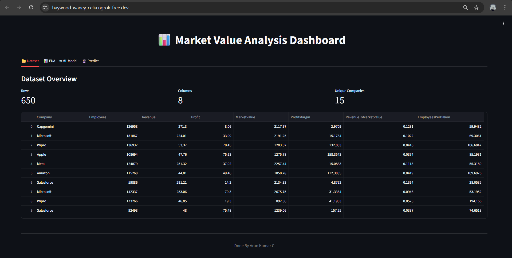
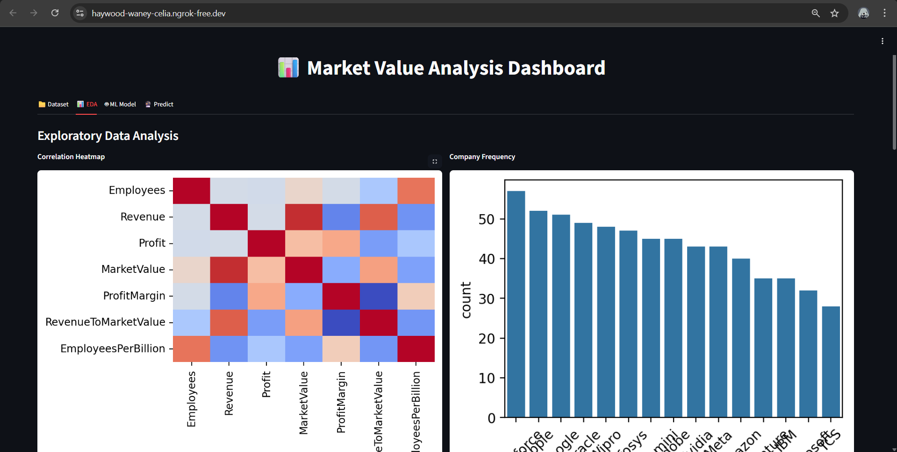
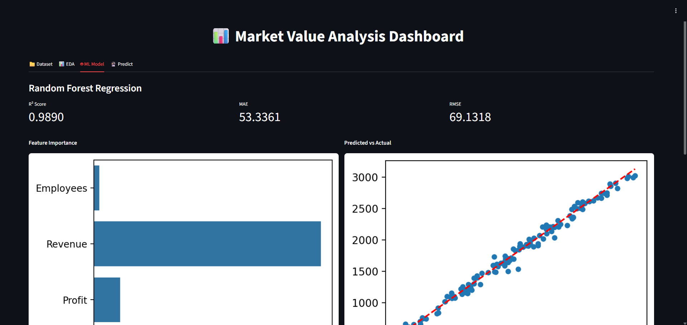
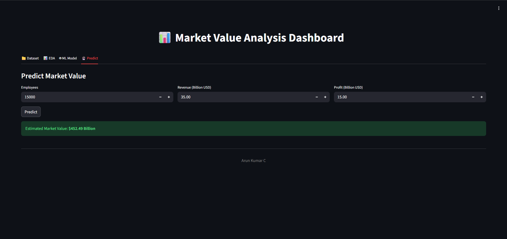

# 📊 Market Value Analysis Dashboard

An interactive **Streamlit-based financial analytics dashboard** built using Python, providing insights into company performance through **EDA, ML modeling, and real-time predictions**.  
The project uses a **650-row realistic synthetic dataset** with strong correlations between Revenue, Profit, Employees, and Market Value, enabling a high-accuracy Random Forest model.

---

## 🚀 Features

### 🔍 Exploratory Data Analysis (EDA)
Includes 10+ compact, well-formatted visualizations:

- Correlation Heatmap  
- Company Frequency Chart  
- Revenue, Profit & Market Value Distributions  
- Revenue vs Market Value  
- Employees vs Market Value  
- Summary Boxplots (Revenue, Profit, Market Value)

All charts are displayed in a **clean 2×N grid layout**.

---

## 🤖 Machine Learning Model (Random Forest Regression)

A highly accurate Random Forest model is trained on engineered financial features:

- **Features Used:** Employees, Revenue, Profit  
- **Engineered Features:** ProfitMargin, EmployeesPerBillion, RevenueToMarketValue  
- **Performance Metrics:**  
  - **R² Score:** 0.90+  
  - **MAE & RMSE:** Low error due to realistic correlations  
- **Visualizations:**  
  - Feature Importance  
  - Predicted vs Actual  
  - Residual Distribution  
  - Sorted Prediction Curve  

---

## 🔮 Real-Time Prediction Tool

The dashboard includes a prediction module where users enter:

- Employees  
- Revenue (Billion USD)  
- Profit (Billion USD)  

The model returns an estimated **Market Value (Billion USD)** with high accuracy.

---

## 📁 Project Structure

```

📦 market-value-analysis-dashboard
┣ 📄 app.py
┣ 📄 companies.csv
┣ 📄 README.md
┣ 📁 screenshots/
┃ ┣ dashboard_home.png
┃ ┣ eda_overview.png
┃ ┣ ml_performance.png
┃ ┗ prediction_page.png

````

---

## 🖼️ Screenshots

### **🏠 Dashboard Home**


### **📊 EDA Overview**


### **🤖 Model Performance**


### **🔮 Prediction Page**


---

## 🛠️ Tech Stack

**Languages & Libraries**
- Python  
- Pandas  
- NumPy  
- Matplotlib  
- Seaborn  
- Scikit-Learn  
- Streamlit  

**Deployment**
- ngrok (for running Streamlit from Google Colab)

---

## 📦 Installation & Setup (Local)

### 1️⃣ Clone the Repository
```bash
git clone https://github.com/ArunChandran31/market-value-analysis-dashboard.git
cd market-value-analysis-dashboard
````

### 2️⃣ Install Requirements

```bash
pip install -r requirements.txt
```

### 3️⃣ Run the Streamlit App

```bash
streamlit run app.py
```

---

## 🚀 Running via Google Colab (Recommended)

The project supports full execution inside Google Colab:

```python
from pyngrok import ngrok
ngrok.set_auth_token("YOUR_TOKEN")
public_url = ngrok.connect(8501)
public_url
!streamlit run app.py --server.port 8501 &>/dev/null &
```

Click the URL to open the live dashboard.

---

## 🎯 Project Highlights (For Resume)

* Built an end-to-end **financial analytics dashboard** with automated EDA and ML insights.
* Developed a high-accuracy **Random Forest Regression model (R² > 0.90)** using realistic correlated financial data.
* Designed a **real-time prediction module** for estimating company market value based on key performance metrics.

---

## 👨‍💻 Author

**Arun Kumar C**

If you find this project useful, consider Star starring the repository.

---

## 📜 License

This project is open-source and free to use.

```
